ГУО «Боровлянская гимназия»

ПОРТФОЛИО

ГИМНАЗИЧЕСКОГО НАУЧНОГО ОБЩЕСТВА УЧАЩИХСЯ

«НОВАЯ НАУКА»

Руководитель общества:

Гавриленко Арина Викторовна, учитель химии

Председатель общества:

Гончарко Андрей, учащийся 10 «А» класса

Добро пожаловать в гимназическое научное общество учащихся "Новая наука" – пространство, где любопытство и стремление к знаниям становятся основой для научного роста и творчества. Участники этого общества, объединены общей целью – исследовать мир вокруг нас, открывать новые горизонты и развивать критическое мышление.

"Новая наука" – это не просто название. Это отражение нашего подхода к обучению и познанию, где каждый из нас может внести свой вклад в общее дело. Мы верим, что наука – это не только набор фактов и теорий, но и увлекательный процесс открытия, который требует смелости, настойчивости и креативности.

В нашем обществе мы стремимся создать атмосферу поддержки и сотрудничества, где каждый участник может делиться своими идеями, проводить исследования и участвовать в различных проектах. Мы организуем мастер-классы, семинары, научные конференции и экскурсии, которые помогают нам углубить знания и расширить горизонты.

Мы уверены, что наука играет ключевую роль в формировании будущего. Наша миссия – вдохновить молодое поколение на изучение различных областей науки, от физики и химии до биологии и экологии. Мы стремимся не только к личному развитию, но и к тому, чтобы внести вклад в общество, решая актуальные проблемы и создавая инновационные решения.

"Новая наука" ждет вас!

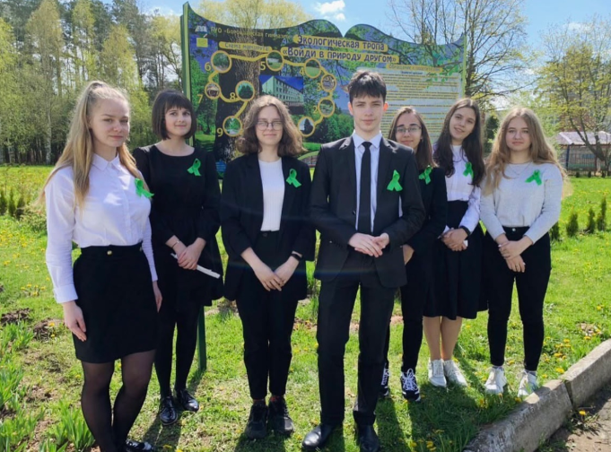

Об обществе

Гимназическое Научное Общество «Новая наука» (ГНОУ) было основано в 2014 году с целью стимулирования интереса учащихся к научным исследованиям и развитию их творческого потенциала. За годы своего существования общество стало важной частью образовательного процесса в гимназии, объединяя учеников, учителей и родителей вокруг идеи науки и инноваций.

Традиции ГНОУ

1. Посвящение в члены общества. В начале учебного года ГНОУ проводит торжественную церемонию посвящения новых членов общества. Это событие символизирует вступление учеников в научное сообщество, где они получают возможность развивать свои идеи и участвовать в интересных проектах. Каждый новый член получает сертификат и значок (с логотипом общества), что подчеркивает важность их вклада в общее дело.

2. Традиционный фестиваль наук. Каждый февраль ГНОУ проводит традиционный фестиваль наук, который стал ярким событием в жизни гимназии. В рамках фестиваля учащиеся представляют свои научные проекты, проводят мастер-классы и интерактивные выставки. Фестиваль привлекает внимание не только учеников, но и родителей, что создает уникальную атмосферу сотрудничества и обмена знаниями.

3. Экологическое направление. Наша уникальная экологическая тропа существует уже 10 лет и является важной частью образовательного процесса в нашем учреждении. Отдельная группа учащихся активно занимается ее развитием и поддержанием, изучая природу, проводя исследования и участвуя в различных экологических акциях. Тропа служит не только местом для прогулок, но и площадкой для практических занятий по экологии, ботанике и биологии.

4. Онлайн-недели на платформе Instagram.  С 2020 года мы проводим онлайн недели на платформе Instagram, что позволяет нам расширять аудиторию и делиться нашими достижениями с более широкой общественностью. Эти мероприятия помогают поддерживать связь с родителями и вовлекать их в образовательный процесс, а также привлекают внимание к нашим инициативам и проектам.

5. Научные экспедиции и выездные семинары.  В рамках программы ГНОУ организуются научные экспедиции и выездные семинары, которые позволяют учащимся погрузиться в практическое изучение науки. Эти мероприятия проводятся в интересных местах, таких как заповедники, научные центры и университеты, где ученики могут не только учиться, но и общаться с профессионалами в своей области.

6. Научные дебаты. В этом году мы внедрили новую традицию – научные дебаты, которые проходят раз в квартал. Учащиеся обсуждают актуальные научные вопросы и проблемы, что развивает их критическое мышление и навыки аргументации. Дебаты становятся площадкой для обмена мнениями и поиска решений.

7. Научный вечер.  Ежегодно ГНОУ организует «Научный вечер», где ученики могут проводить эксперименты, участвовать в научных шоу и слушать лекции приглашенных спикеров. Это событие привлекает множество участников и создает атмосферу увлеченности наукой, позволяя ученикам исследовать мир науки в неформальной обстановке.

8. Тайные заседания. В этом году мы также начали проводить тайные заседания ГНОУ, на которых обсуждаются самые смелые идеи и проекты. Эти встречи создают атмосферу доверия и открытости, позволяя участникам делиться своими мыслями без страха быть осуждаемыми. Тайные заседания помогают выявлять скрытые таланты и вдохновлять участников на новые достижения.

9. Летний научный лагерь «Новая наука».  В июне 2026 года впервые в истории гимназии планируется проведение летнего научного лагеря «Новая наука». Этот лагерь предоставит учащимся уникальную возможность углубить свои знания, работать над проектами в команде и общаться с экспертами в различных областях науки. Мы уверены, что это станет незабываемым опытом для всех участников.

Гимназическое Научное Общество «Новая наука» продолжает развиваться и адаптироваться к современным требованиям образования, сохраняя при этом свои традиции. Мы гордимся тем, что можем предложить нашим учащимся уникальные возможности для самореализации и научного роста, а также вдохновлять новое поколение исследователей и инноваторов.

СТРУКТУРА ГНОУ «НОВАЯ НАУКА»

2025/2026 учебный год

Руководитель ГНОУ – Гавриленко Арина Викторовна,    учитель химии

Председатель ГНОУ – Гончарко Андрей,  учащаяся X «А» класса

Секции научного общества | Руководители секций | Ступени обучения

Литературные и исторические горизонты (Русский язык и литература, белорусский язык и литература, история и обществоведение) | Скавинская Елена Владимировна (учитель русского языка и литературы) | II-III

Научно-техническая секция (Математика. Информатика. Физика. Астрономия. Трудовое обучение) | Невер Елена Петровна (учитель математики) | 

Секция естественных наук (Химия. Биология. География. Экология) | Макарова Жанна Петровна (учитель биологии) | 

Секция иностранных языков (английский язык, китайский язык и немецкий язык) | Кузякова Ольга Викторовна (учитель английского языка) | 

Маленькие исследователи (начальная школа) | Пивоварчик Юлия Алексеевна (учитель начальных классов) | I

Секции научного общества | Руководители с екций (учащиеся) | Количество исследователей в секции

Литературные и исторические горизонты | Ершов Никита | 13

Научно-техническая секция | Соловьева Юлия | 17

Секция естественных наук | Виниченко Милана | 15

Секция иностранных языков | Свистун Аркадий | 9

Маленькие исследователи | Жарко Яна | 6

Общее количество исследователей ГНОУ – 60.

РУКОВОДИТЕЛЬ ГНОУ «НОВАЯ НАУКА»

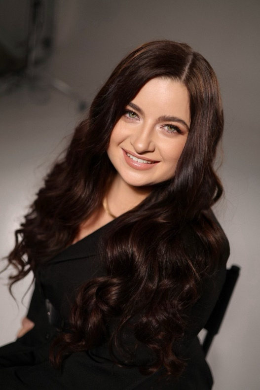

Гавриленко Арина Викторовна,

учитель химии высшей

квалификационной категории

Член областного клуба педагогических работников «Флагман», участник творческих групп учителей химии и биологии областного и республиканского уровней.

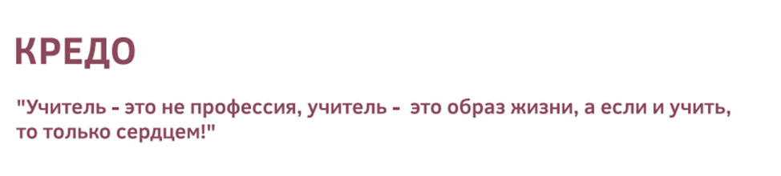

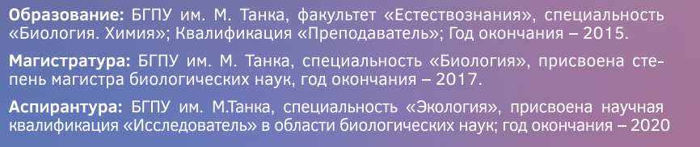

Тема магистерской диссертации: «Экологическая тропа  как интегративная форма  экологического образования студентов педагогического вуза»

Тема кандидатской диссертации: «Оценка чистоты воздуха на основе состояния эпифитных лихеносинузий антропогенных и природных экосистем»

Автор более 50 статей в различных сборниках и журналах.

Автор 5 актов внедрения.

Создатель предметных онлайн-недель на платформе Instagram. (Свидетельство «Форсайт экспертиза» подтверждает, что методическая разработка «Проведение предметных онлайн-недель на платформе Instagram как средство развития познавательного интереса учащихся» прошла экспертную оценку и рекомендована к распространению).

Автор-разработчик экологической тропы “Войди в природу другом” ГУО Боровлянская гимназия (методический продукт).

Победитель Республиканского конкурса Telegram-каналов "Время Telegram" Диплом I степени Канал "Преподавание с ЛЮБОВЬЮ" https://t.me/chimiaAV

Интервью для программы «Женская среда»  («Радио-Минск») 1октября 2025 года. Ссылка на подкаст: https://minsknews.by/podkasty-radio-minsk/?ysclid=mfv0nckq2g397298532

Контакты:

+375447652726

Inst: @arina_gavrilenko, @ arina_chemistry

ПРЕДСЕДАТЕЛЬ ГНОУ «НОВАЯ НАУКА»

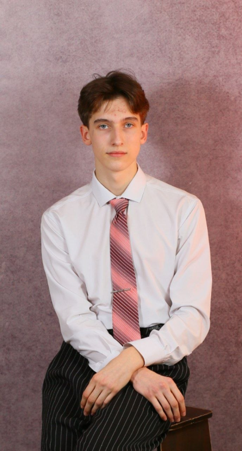

Гончарко Андрей Алексеевич

Учащийся 10 «А» класса с углубленным изучением физики и математики.

Увлекается олимпиадной и исследовательской деятельностью по математике. Специализируется на геометрии, в частности преобразованиях плоскости, и комбинаторике.

Продолжительное время специализировался на экстремальной теории графов в рамках Республиканского турнира юных математиков: решал предложенные  пункты, обобщал полученные результаты, анализировал отечественные и зарубежные статьи по теме

Идеи и вдохновение берет из музыки.

Достижения:

Победитель III этапа республиканской олимпиады по математике (диплом III степени).

Победитель Республиканского турнира юных математиков (диплом II степени).

Абсолютный победитель областной конференции в разделе "математика" и дважды участник республиканских конференций (XXIX и XXX конференции работ учащихся исследовательского характера).

Участник заключительного этапа Всероссийской олимпиады "Высшая проба" на базе университета "ВШЭ" по математике

САЙТ НАУЧНОГО ОБЩЕСТВА

Разработчик сайта: Бурак Андрей  (учащийся 11 «Б» класса)

Полностью отвечает за информационную сторону гимназического общества.

Достижения:

Олимпиадник по информатике: успешно участвует в олимпиадах, демонстрируя высокий уровень знаний и навыков.

Командная работа: в его команде пять учащихся, которые обучаются у Андрея и перенимают его опыт для дальнейшего ведения сайта.

Поддержка учащихся:

Андрей активно помогает другим гимназистам в создании презентаций для защиты учебных проектов.

Периодически проводит мастер-классы на темы: «Создание эффективных презентаций» и  «Использование информационных технологий в учебном процессе»

Андрей не только разрабатывает сайт, но и вдохновляет учащихся на изучение информатики и развитие навыков работы с информационными технологиями.

Сюда ссылку на сайт + скрин вставить

УСТАВ И ПОЛОЖЕНИЕ О ГНОУ

ЛОГОТИП

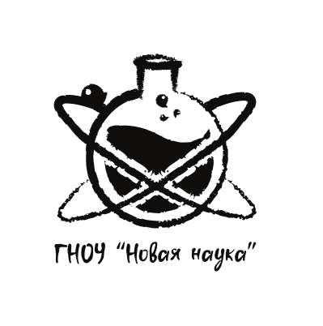

ДЕВИЗ:

"Знание — сила, наука — путь к будущему!"

КРЕДО:

"Мы стремимся к познанию, исследуем мир вокруг, открываем новые горизонты и верим в силу науки. Каждый день — это шанс узнать что-то новое и сделать шаг к светлому будущему!"

ГИМН

Гимн (на слова песни Юлии Савичевой "Если в сердце живет любовь"):

Куплет 1

Проходят дни, пролетают года,

И рождаются идеи…

А ты идёшь — в твоей душе и глазах

Свет открытий и стремлений

Но не смотри, не смотри ты по сторонам,

Оставайся таким как есть,

Не сдавайся ты никогда.

Целый мир озаряет науки свет,

Если в сердце живёт мечта!

Припев

Не смотри, не смотри ты по сторонам,

Оставайся таким, как есть,

Не сдавайся ты никогда.

Целый мир озаряет науки свет,

Если в сердце живёт мечта.

Куплет 2

Через тернии к звездам мы идем и не боимся поражений,

Не спеши — каждый опыт и расчет нас приближает вновь к победам!

Не смотри, не смотри ты по сторонам,

Оставайся таким, как есть,

Не сдавайся ты никогда.

Целый мир озаряет науки свет,

Если в сердце живёт мечта.

Припев

Не смотри, не смотри ты по сторонам,

Оставайся таким, как есть,

Не сдавайся ты никогда.

Целый мир озаряет науки свет,

Если в сердце живёт мечта.

Припев (финал)

Не смотри, не смотри ты по сторонам,

Оставайся таким, как есть,

Не сдавайся ты никогда.

Целый мир озаряет науки свет,

Если в сердце живёт мечта.

Не смотри, не смотри ты по сторонам,

Оставайся таким, как есть,

Не сдавайся ты никогда.

Целый мир озаряет науки свет,

Если в сердце живёт мечта.

ПЛАН РАБОТЫ

ГИМНАЗИЧЕСКОГО НАУЧНОГО ОБЩЕСТВА УЧАЩИХСЯ «НОВАЯ НАУКА» НА 2024/2025 УЧЕБНЫЙ ГОД

№ | СОДЕРЖАНИЕ РАБОТЫ | СРОКИ | ОТВЕТСТВЕННЫЕ

 | Заседание ГНОУ. Ор ганизация деятельности в 2024 / 2025 учебном году | Сентябрь | Гавриленко А.В.

 | Разработка и утверждение плана работы ГНОУ | Сентябрь | Гавриленко А.В.

 | Индивидуальное собеседование с учащимися и учителями по планированию исследовательской деятельности и выбор темы | Сентябрь | Гавриленко А.В.

 | Консультационные занятия с учащимися и учителями по вопросам методики исследовательской деятельности | В течение года | Гавриленко А.В.

 | Организация работы по привлечению преподавателей ВУЗов для работы с учащимися по подготовке к конкурсу исследовательских работ | Сентябрь, далее в течение года | Рынкевич Н.П. Гавриленко А.В.

 | Организация экскурсий на экологической тропе | В течение года | Гавриленко А.В.

 | Проведение онлайн-недель на платформе Instagram | В течение года | Гавриленко А.В.

 | Консультативная работа по темам: выбор темы исследовательской работы; правила оформления работы; поиск и выбор форм и методов работы; работа с литературой, составление списка литературы; основные правила, поиск и обработка литературных источников |  | Гавриленко А.В.

 | Организация мастер-классов для учащихся и учителей | В течение года | Гавриленко А.В.

 | Организация работы по активации контактов с зарубежными партнерами в рамках международного сотрудничества в сфере образования | Сентябрь | Рынкевич Н.П. Гавриленко А.В.

 | Посвящение в члены общества | Сентябрь | Гавриленко А.В. Администрация гимназии

 | Участи е в конференциях, семинарах, тр енингах, проводимых ВУЗами | В течение года | Рынкевич Н.П. Гавриленко А.В.

 | Участие в международных конкурсах и конференциях для учащихся | В течение года | Рынкевич Н.П. Гавриленко А.В.

 | Участие в конкурсе для школьников «Открывая мир интеллектуальной собственности 2024 » | Сентябрь | Гавриленко А.В.

 | Мастер-класс для учителей начальных классов на тему: «Как работать над проектом. Первые шаги в проектно-исследовательскую деятельность» | Октябрь | Гавриленко А.В.

 | Подготовка и участие в конкурсе работ исследовательского характера (конференция) учащихся учреждений образования Минской области | Сентябрь- октябрь | Гавриленко А.В. Научные руководители

 | Участие в IX областном мини-турнире юных математиков | Октябрь | Шабан А.В. Невер Е.П.

 | Подготовка и участие в XII областном турнире юных математиков | Сентябрь- октябрь | Шабан А.В. Невер Е.П.

 | Заседание ГНОУ. Организация работы научных секций | Октябрь | Гавриленко А.В.

 | Создание сайта ГНОУ и своевременное обновление материалов | Октябрь | 

 | Проведение 1 этапа конкурса исследовательских работ и творческих проектов детей младшего школьного возраста «Я – исследователь» | Ноябрь | Баранова А.С .

 | Подготовка и участие в конкурсе научных биолого-экологических работ учащихся учреждений общего среднего образования | Декабрь- январь | Гавриленко А.В. Макарова Ж.П .

 | Участие во 2 этапе конкурса исследовательских работ и творческих проектов детей младшего школьного возраста «Я – исследователь» | Январь | Баранова А.С.

 | Участие в предметных неделях | В течение года | Рынкевич Н.П. Гавриленко А.В. Руководители МО

 | Заседание ГНОУ. Подготовка и проведение конкурса исследовательских работ ГННУ | Январь | Гавриленко А.В.

 | Фестиваль наук «Наука – это наша ЖИЗНЬ» | Февраль | Гавриленко А.В. Научные руководители

 | Подготовка и участие в международном Балтийском научно- инженерном конкурсе | Ф евраль | Гавриленко А.В. Макарова Ж.П.

 | Участие в районном конкурсе работ учащихся исследовательского характера | Февраль | Гавриленко А.В. Научные руководители

 | Участие в Республиканском конкурсе исследовательских работ учащихся (конференция) | Март | Гавриленко А.В. Научные руководители

 | Подготовка и участие в областном мини-турнире юных математиков | Март- апрель | Шабан А.Б. Невер Е.П.

 | Заседание ГНОУ. Об итогах участия в районном конкурсе исследовательских работ ГНОУ | Апрель | Гавриленко А.В.

 | Представление научно-методических работ педагогов и учащихся гимназии для создания коллективной монографии | Апрель | Гавриленко А.В. Руководители МО

 | Организация научного вечера | Май | Гавриленко А.В.

 | Предварительное формирование банка тем исследовательских работ на 2026/2027 учебный год | Май | Гавриленко А.В .

 | Участие в гимназическ ом конкурсе «Гимназист года 2026 » в номинации «Шаг в науку» | Май | Гавриленко А.В .

 | Заседание ГНОУ. Подведение итогов работы в 2024/2025 учебном году, предварител ьное планирование работы на 2025/2026 учебный год | Май | Гавриленко А.В.

ПЛАН РАБОТЫ

ГИМНАЗИЧЕСКОГО НАУЧНОГО ОБЩЕСТВА УЧАЩИХСЯ «НОВАЯ НАУКА» НА 2025/2026 УЧЕБНЫЙ ГОД

№ | СОДЕРЖАНИЕ РАБОТЫ | СРОКИ | ОТВЕТСТВЕННЫЕ

 | Заседание ГНОУ. Организация деятельности в 2025 / 2026 учебном году | Сентябрь | Гавриленко А.В.

 | Разработка и утверждение плана работы ГНОУ | Сентябрь | Гавриленко А.В.

 | Индивидуальное собеседование с учащимися и учителями по планированию исследовательской деятельности и выбор темы | Сентябрь | Гавриленко А.В.

 | Организация работы по привлечению преподавателей вузов для работы с учащимися по подготовке к конкурсу исследовательских работ | Сентябрь, далее в течение года | Рынкевич Н.П. Гавриленко А.В.

 | Консультации по темам: - выбор темы исследовательской работы; - правила оформления работы; - поиск и выбор форм и методов работы; - работа с литературой, составление списка литературы; - основные правила, поиск и обработка литературных источников | В течение года | Гавриленко А.В.

 | Участи е в конференциях, семинарах, тренингах, проводимых вуз ами | В течение года | Рынкевич Н.П. Гавриленко А.В.

 | Участие в международных конкурсах и конференциях для учащихся | В течение года | Рынкевич Н.П. Гавриленко А.В.

 | Проведение онлайн-недель на платформе Instagram | В течение года | Рынкевич Н.П. Гавриленко А.В.

 | Организация экскурсий на экологической тропе | В течение года | Гавриленко А.В.

 | Организация мастер-классов для учащихся и учителей | В течение года | Гавриленко А.В.

 | Организация научных экспедиций и выездных семинаров | В течение года | Гавриленко А.В.

 | Организация научных дебатов | В течение года | Гавриленко А.В.

 | Посвящение в члены общества | 08.09.2025 | Гавриленко А.В. администрация гимназии

 | Мастер-класс для учителей «Методы научного исследования: знакомство с основными методами и подходами в научной работе» | 13.09 .2025 | Гавриленко А.В.

 | Мастер-класс для учащихся « Работа в команде: как эффективно сотруднич ать в исследовательских группах» | 20.09.2025 | Гавриленко А.В.

 | Мастер-класс для учителей « Научные публикации: как писать статьи и представлять свои исследования» | 27.09.2025 | Гавриленко А.В.

 | Подготовка и участие в конкурсе работ исследовательского характера (конференция) учащихся учреждений образования Минской области «От исследований | Сентябрь- октябрь | Гавриленко А.В. р уководители исследовательских работ

 | Участие в XVI областном турнире юных математиков | Октябрь | Шабан А.В. Невер Е.П.

 | Заседание ГНОУ. Организация работы научных секций | Октябрь | Гавриленко А.В.

 | Проведение 1 этапа конкурса исследовательских работ и творческих проектов детей младшего школьного возраста «Я – исследователь» | Ноябрь | Баранова А.С. Виноградова И.С.

 | Подготовка и участие в конкурсе научных биолого-экологических работ учащихся учреждений общего среднего образования | Декабрь- январь | Гавриленко А.В. Макарова Ж.П .

 | Участие во 2 этапе конкурса исследовательских работ и творческих проектов детей младшего школьного возраста «Я – исследователь» | Январь | Баранова А.С. Виноградова И.С.

 | Мастер-класс для учащихся « Научная коммуникация: как представить результаты исследо вания (презентации, публикации)». | Январь | Гавриленко А.В.

 | Участие в предметных неделях | В течение года | Рынкевич Н.П. Гавриленко А.В.

 | Заседание ГНОУ. Подготовка и проведение гимназического конкурса работ учащихся исследовательского характера | Январь | Гавриленко А.В.

 | Заседание ГНОУ. Подготовка и оформление плана для фестиваля наук. | 02.02.2026 | Гавриленко А.В.

 | Фестиваль наук «Наука – это наша ЖИЗНЬ» | Февраль (9-14 февраля) | Гавриленко А.В. р уководители исследовательских работ

 | Подготовка и участие в международном Балтийском научно-инженерном конкурсе | Ф евраль - март | Гавриленко А.В. Макарова Ж.П.

 | Участие в районном этапе XXXI конкурса работ исследовательского характера учащихся | 07.02.2026 | Гавриленко А.В. р уководители исследовательских работ

 | Участие в Республиканском конкурсе исследовательских работ учащихся (конференция) | Февраль | Гавриленко А.В. р уководители исследовательских работ

 | Мастер-класс для учащихся « Создание и управление исследовательским проектом » | 27.02.2026 | Гавриленко А.В.

 | Подготовка и участие в XIV областном мини-турнире юных математиков | Март- апрель | Шабан А.Б. Невер Е.П.

 | Заседание ГНОУ. Об итогах участия в районном конку рсе работ учащихся исследовательского характера, перспективы участия в областном конкурсе | Апрель | Гавриленко А.В.

 | Консультации учащихся и учителей по выбору тем на следующий учебный год | Апрель | Гавриленко А.В.

 | Мастер-класс для учащихся « Интердисциплинарные исследования: как сочетать знания из разных областей для решения комплексных проблем» | Апрель | Гавриленко А.В.

 | Организация научного вечера | Май | Гавриленко А.В.

 | Предварительное формирование банка тем исследовательских работ на 2026/2027 учебный год | Май | Гавриленко А.В .

 | Чествование победителей номинации «Шаг в науку» гимназическ ого конкурса «Гимназист года 2026» | Май | Руководство гимназии

 | Заседание ГНОУ. Подведение итогов работы в 2025/2026 учебном году, предварител ьное планирование работы на 2026/2027 учебный год Разработка плана и выбор команды для летнего научного лагеря «Новая наука»: новый сезон | Май | Гавриленко А.В.

СОТРУДНИЧЕСТВО  С ВЫСШИМИ УЧЕБНЫМИ ЗАВЕДЕНИЯМИ

КАКИЕ?????

В рамках нашей деятельности гимназического научного общества "Новая наука" мы активно сотрудничаем с ведущими высшими учебными заведениями, что позволяет нашим учащимся получать уникальные возможности для обучения и развития.

Мы гордимся партнерством с Белорусским государственным педагогическим университетом (БГПУ), где наши ученики могут участвовать в различных образовательных программах и научных проектах, а также обмениваться опытом с преподавателями и студентами.

Кроме того, мы сотрудничаем с Белорусским государственным медицинским университетом (БГМУ), в рамках которого были созданы специализированные медицинские классы. Это сотрудничество предоставляет нашим учащимся возможность погрузиться в мир медицины, изучать актуальные темы и развивать навыки, необходимые для будущей профессии в сфере здравоохранения.

Также мы взаимодействуем с Белорусским национальным техническим университетом (БНТУ), что открывает двери для наших студентов в области инженерии и технологий. Совместные проекты и мастер-классы помогают развивать технические навыки и креативное мышление.

Это сотрудничество с высшими учебными заведениями обогащает образовательный процесс, вдохновляет учащихся на новые достижения и помогает им строить успешную карьеру в будущем. Мы уверены, что совместные усилия приведут к новым открытиям и значимым результатам!

ПРОГРАММА РАЗВИТИЯ ГИМНАЗИЧЕСКОГО НАУЧНОГО ОБЩЕСТВА "НОВАЯ НАУКА" (ГНОУ) НА 2024-2029 ГОДЫ

Программа развития ГНОУ на 2024-2029 годы направлена на создание условий для всестороннего развития учащихся, повышение качества образования и активизацию научной деятельности. Основные цели программы включают внедрение инновационных образовательных технологий, развитие научных исследований, укрепление сотрудничества с высшими учебными заведениями и расширение участия учащихся в конкурсах и олимпиадах.

Цели программы

1. Улучшение качества образования: Обеспечение высоких стандартов обучения через внедрение современных методик и технологий.

2. Развитие научного потенциала: Поддержка научно-исследовательской деятельности учащихся, создание условий для реализации их проектов.

3. Сотрудничество с ВУЗами: Укрепление партнерских связей с высшими учебными заведениями для организации совместных мероприятий и программ.

4. Расширение участия в конкурсах: Активизация участия учащихся в республиканских и международных конкурсах и  конференциях.

5. Формирование навыков XXI века: Развитие критического мышления, креативности, командной работы и цифровых навыков.

Основные направления работы

1. Образовательные инновации

– Внедрение проектного обучения и исследовательских методов в учебный процесс.

– Организация мастер-классов и тренингов по современным образовательным технологиям.

– Создание онлайн-платформы для обмена опытом и ресурсами между учащимися.

2. Научно-исследовательская деятельность

– Проведение ежегодных научных конференций для демонстрации проектов учащихся.

– Поддержка индивидуальных и групповых научных проектов, включая финансирование лучших идей.

3. Сотрудничество с ВУЗами

– Разработка совместных образовательных программ с БГПУ, БГМУ и БНТУ.

– Проведение открытых лекций и семинаров с участием преподавателей ВУЗов.

– Участие в совместных научных исследованиях и проектах.

4. Конкурсы

– Организация внутреннего конкурса научных проектов среди учащихся.

– Подготовка учащихся к участию в республиканских и международных конкурсах

– Создание системы наставничества для поддержки участников конкурсов ( с 2024 года внедрена)

5. Развитие soft skills

– Введение курсов по развитию критического мышления, коммуникации и лидерства.

– Организация командных игр и тренингов для формирования навыков работы в команде.

– Проведение занятий по основам предпринимательства и финансовой грамотности.

Ожидаемые результаты

• Повышение уровня успеваемости и научной активности учащихся.

• Увеличение числа победителей и призеров на конкурсах

• Укрепление связей с высшими учебными заведениями и научными организациями.

• Формирование у учащихся навыков, необходимых для успешной карьеры в будущем.

Заключение

Программа развития ГНОУ на 2024-2029 годы направлена на создание динамичной образовательной среды, способствующей развитию научного потенциала учащихся и формированию у них необходимых компетенций для успешного будущего. Мы уверены, что реализация данной программы приведет к значительным успехам как на уровне гимназии, так и в жизни каждого ученика.

АНАЛИТИЧЕСКАЯ ИНФОРМАЦИЯ ДЕЯТЕЛЬНОСТИ ГНОУ ПО ИТОГАМ ГОДА

▎1. Введение

• Краткое описание учреждения (цели, миссия, основные направления деятельности).

• Период, за который представлена информация.

▎2. Основные достижения

• Перечень значимых достижений за год (например, количество проведенных мероприятий, проектов, новых программ).

• Успехи в образовательной деятельности (например, результаты экзаменов, конкурсов, олимпиад).

• Инновации и внедрение новых технологий в образовательный процесс.

▎3. Статистические данные

• Количество учащихся на начало и конец года.

• Динамика набора учащихся (рост или снижение численности).

• Количество педагогических работников и их квалификация.

• Участие в конкурсах и мероприятиях (количество участников, призовые места).

▎4. Проекты и инициативы

• Описание реализованных проектов (тематика, цели, результаты).

• Участие в региональных и федеральных программах.

• Сотрудничество с другими образовательными учреждениями и организациями.

▎5. Проблемы и вызовы

• Основные проблемы, с которыми столкнулось учреждение в течение года.

• Вызовы, требующие решения для дальнейшего развития.

▎6. Планы на следующий год

• Основные цели и задачи на следующий учебный год.

• Намеченные проекты и инициативы.

• Ожидаемые изменения в образовательной программе.

▎7. Заключение

• Общая оценка деятельности учреждения за год.

• Благодарности партнерам, сотрудникам и учащимся за вклад в развитие учреждения.

▎Приложения

• Графики и таблицы с данными.

• Фотографии мероприятий.

• Отзывы участников о проектах и мероприятиях.

РЕЗУЛЬТАТИВНОСТЬ ЗА ПОСЛЕДНИЕ ТРИ ГОДА

СПИСОК ПУБЛИКАЦИЙ ЗА ТРИ ГОДА

Особое внимание ГНОУ уделяет

ЭКОЛОГИЧЕСКОМУ НАПРАВЛЕНИЮ

ПЕРСПЕКТИВНАЯ ТЕРРИТОРИЯ: ЭКОЛОГИЧЕСКАЯ ТРОПА ОТ РЕАЛЬНОСТИ К ВИРТУАЛЬНОСТИ

С 2016 года на территории ГУО «Боровлянской гимназия» эксплуатируется экологическая тропа. С момента ее создания на данной учебно-практической площадке систематически проводятся экскурсии, трудовые десанты, экологические акции и уроки под открытым небом. В связи с тем, что в 2026 году нашей экологической тропе исполняется 10 лет, мы решили создать новый  продукт – виртуальную тропу, а также виртуального помощника к ней (чат-бота).

Актуальность разработки виртуальной экотропы и чат-бота-помощника обусловлена необходимостью адаптации экологического образования к современным условиям. В условиях цифровизации и широкого распространения информационных технологий важно обеспечить доступность и привлекательность образовательных ресурсов для учащихся.

Представляем вам два методических продукта: виртуальную экологическую тропу и чат-бота. Давайте подробнее рассмотрим каждый из них.

Виртуальная экологическая тропа представляет собой инновационный подход, сочетающий технологии дополненной реальности и интерактивное обучение для повышения экологической осведомленности и развития функциональной грамотности. Её основные принципы включают доступность, интерактивность и погружение в природную среду, обеспечивая тем самым глубокое понимание экологических процессов и устойчивого образа жизни.

Практические примеры использования виртуальной тропы в образовательном процессе:

Интерактивное обучение: Виртуальная экологическая тропа позволяет учащимся исследовать природу в безопасной среде, повышая интерес к экологии.

Интеграция знаний: Использование мультимедийных материалов на     тропе способствует глубокому усвоению теоретических знаний через практические задания и задачи.

Разноуровневый подход: Тропа адаптируется под разные возрастные категории и уровни подготовки учащихся, обеспечивая индивидуализацию обучения.

ВИРТУАЛЬНАЯ ЭКОЛОГИЧЕСКАЯ ТРОПА

включает следующие разделы:

Паспорт экологической тропы

Станции экологической тропы

Методичка

Экскурсии и методические разработки

Наши достижения и сотрудничество

Новости

Описание каждого раздела

Паспорт экологической тропы содержит всю необходимую информацию о действующей экологической тропе, схему маршрута, стенд экотропы, график работы.

Раздел «Станции экологической тропы»  состоит из 10 вкладок, посвященных описанию каждой станции экотропы:

Станция 1. Хвойная

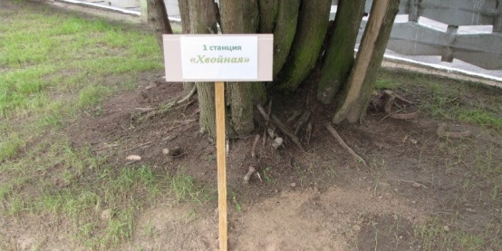

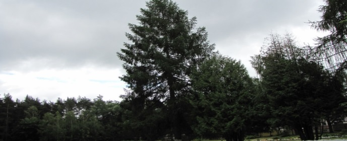

Станция 2. Цветник “Капля”

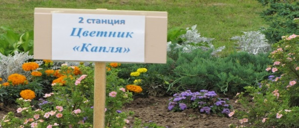

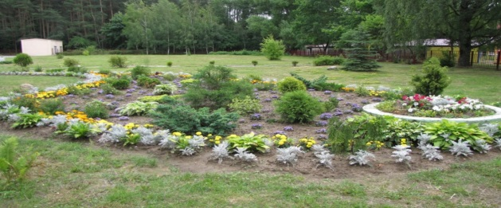

Станция 3.   Искусственный пруд «Кувшинка»

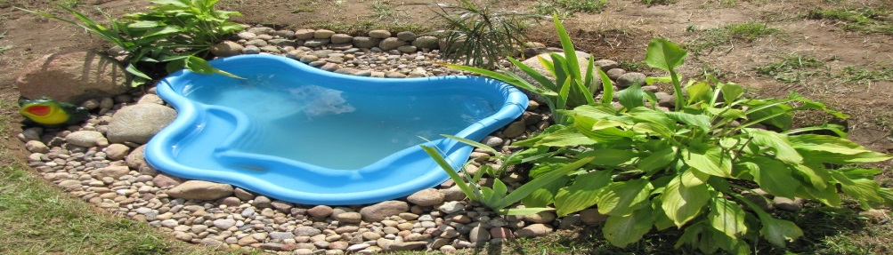

Станция 4.  Исследовательская «Найди себя»

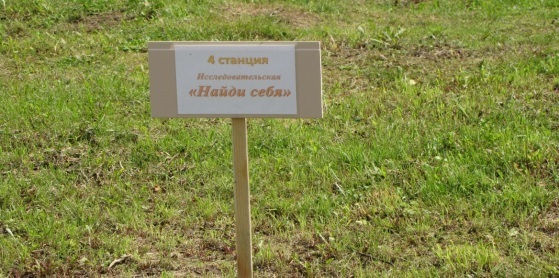

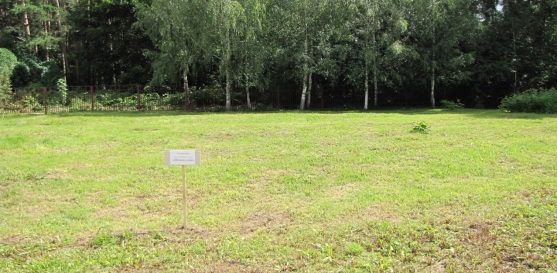

Станция 5. Молодые дубки

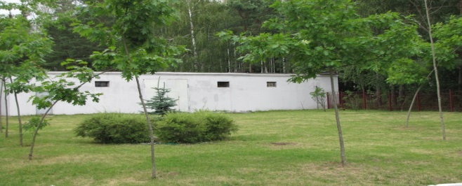

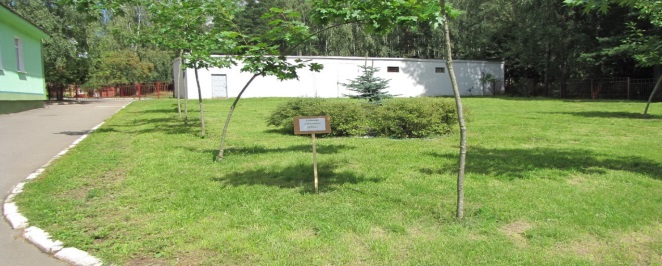

Станция 6. Березовая аллея

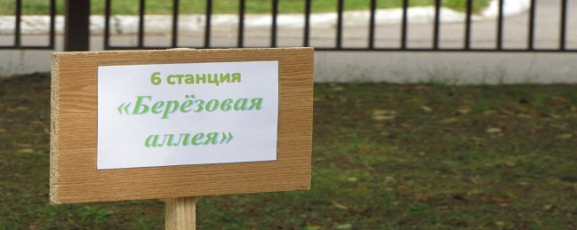

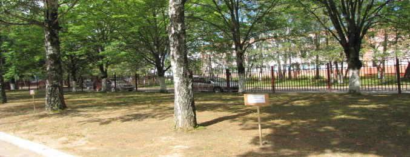

Станция 7. Кормушка для птиц

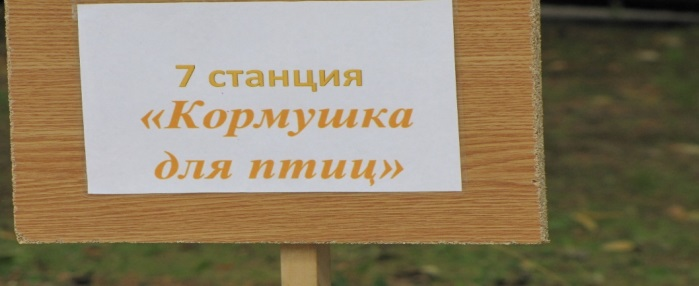

Станция 8. Дендрарий

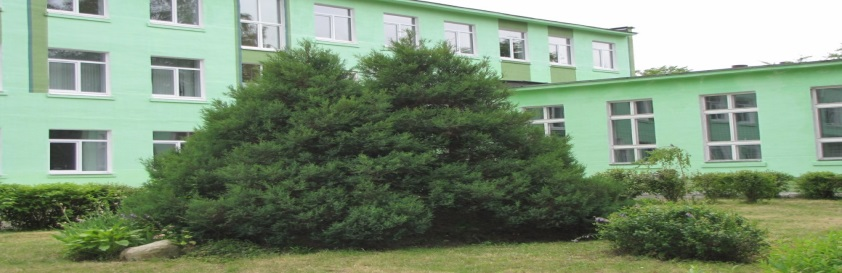

Станция 9. Каштановая аллея

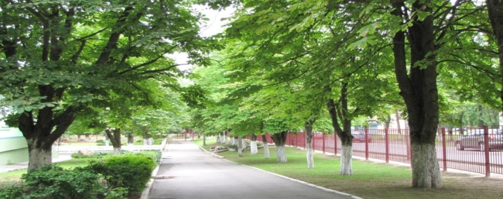

Станция 10. Клумба «Пейзаж»

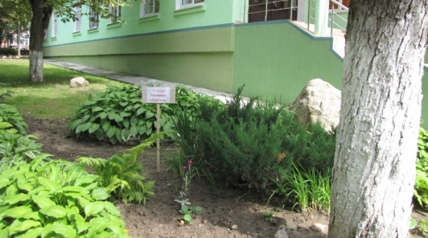

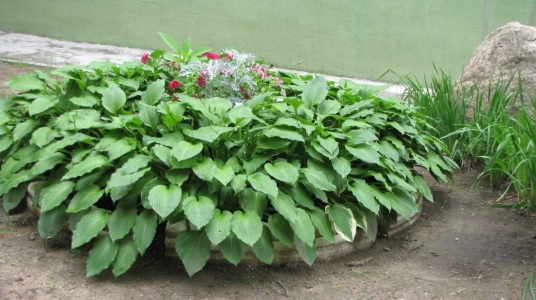

Каждая вкладка активна и содержит описание объектов, расположенных на каждой станции. Эта информация используется для проведения экскурсий.

В этом же разделе находится 10 активных вкладок, содержащих задания для развития функциональной грамотности учащихся. Все задания распределены и приурочены к определенным станциям. Задания также используются для проведения экскурсий и вкладки будут пополняться полезным материалом.

Ссылка на виртуальную тропу «Войди в природу другом»

Методичка "Сохраняя природу: Методические рекомендации по разработке экологических троп — от реальных маршрутов до виртуальных путешествий"

Методические рекомендации по созданию экологических троп:

Общие принципы создания экологической тропы

Этапы создания и оформления экологической тропы.

Правила поведения на экологической тропе

Пример экологической тропы

Экскурсии и методические разработки

В этом разделе вы найдете разработанные уроки-экскурсии и разнообразные мероприятия, которые помогут углубить знания и расширить кругозор учащихся. Каждое мероприятие направлено на активное вовлечение, развитие критического мышления и практических навыков, а также на укрепление командного духа и сотрудничества. Мы стремимся создать увлекательную и образовательную атмосферу, где каждый сможет найти что-то интересное и полезное для себя.

Наши достижения и сотрудничество

Печатная деятельность

Маврищев В.В., Гавриленко А.В. Формирование экологоцентрического мышления студентов посредством экологической тропы // Республиканская научно-практическая экологическая конференция «Проблемы оценки, мониторинга и сохранения биоразнообразия». Брест, 23 ноября 2017 г. С. 269-274.

Гавриленко А.В., Макарова Ж.П.,Кашкан А., Скалозуб П., Учебная экологическая тропа «Войди в природу другом» // Международный конкурс исследовательских работ «Игры разума» (сборник материалов), Могилев, 21 - 23 февраля 2018 г. С. 71-73.

Гавриленко А.В. Войди в природу другом: о создании учебной экологической тропы//  Образование Минщины,  3-4 сентября 2018 г.         С. 55-56.

Гавриленко А.В. Трансплантация лишайников как один из методов лихеноиндикации //  Международная конференция молодых ученых «Актуальные проблемы ботаники и экологии» Украина, 3-4 сентября 2018 г. С. 13.

Гавриленко А.В. Экологическая тропа – перспективная учебная территория // Сборник статей Международного научно – методического конкурса «Преподаватель года 2018»,  28 декабря    2018 г. С. 134-151.

Гавриленко А.В. Учебная экологическая тропа «Войди в природу другом» // Международный научный журнал «Молодой ученый» № 4, 28 декабря  2018 г. С. 192-196.

Гавриленко А.В. Шалфей мускатный и шалфей лекарственный  //  Международный научный журнал «Молодой ученый» № 6, февраль  2019 г. С. 35-40.

Гавриленко А.В. Экологическая тропа и творческая деятельность учащихся //  Международный научный журнал «Молодой ученый» № 6, февраль  2019 г. С. 209-212.

Гавриленко А.В. Планирование и организация учебной экологической тропы на примере агробиостанции "Зеленое" и ГУО "Боровлянская гимназия"// Сборник статей Международного научно – методического конкурса «Педагогическое призвание 2019»,  10 февраля    2019 г. С. 24-33.

Гавриленко А.В. Экологическая тропа и творческая деятельность учащихся // Сборник статей Международной научно – исследовательской конференции  «Научные достижения в высшей школе 2019»,  28 апреля   2019 г. С. 128-136.

Гавриленко А.В. Макарова Ж.П. Оценка экологического состояния пришкольных участков агр. Лесной при помощи флуктурирующей ассиметрии листовой пластинки березы повислой(Betula pendula Roth) // Сборник статей Международного научно – исследовательского конкурса «Исследователь года 2019»,  12 мая 2019 г. С. 131-141.

Гавриленко А.В. Организация учебной экологической тропы ГУО "Боровлянская гимназия" // Сборник статей Международного научно – интеллектуального конкурса «Youth for science 2019»,  26 мая  2019 г. С. 343-352.

Гавриленко А.В. Влияние ЭМИ на рост и развитие шалфея мускатного и шалфея лекарственного // Сборник статей Международного научно – методического конкурса «Преподаватель года 2019»,  15 октября    2019 г. С. 168-175.

Гавриленко А.В. Оценка экологического состояния пришкольных участков агр. Лесной при помощи флуктурирующей ассиметрии листовой пластинки березы повислой // Международный научный журнал «Молодой ученый» № 22, ноябрь  2019 г. С. 63-67.

Мастер-классы для учителей

(проводились с 2017 по 2026 год)

1. Экологическое проектирование троп: принципы и методы

2. Устойчивое развитие рекреационных маршрутов: биологические и экологические аспекты

3. Интеграция экосистемных услуг в проектирование экологических троп

4. Системный подход к созданию устойчивых природных маршрутов

5.Экологические коридоры: проектирование и управление для сохранения биоразнообразия

6. Экосистемный подход к проектированию туристических маршрутов"

7. Анализ воздействия на окружающую среду при создании экологических троп

8. Планирование и реализация устойчивых пешеходных маршрутов: от концепции до практики

9. Взаимодействие человека и природы: создание гармоничных экотроп

10.Инновационные технологии в проектировании и управлении экологическими маршрутами

Также между Боровлянской гимназией и БГПУ им. М. Танка заключены два акта внедрения по работе на экологических тропах: «Экологическая тропа и творческая деятельность учащихся» и «Экологическая тропа как интегративная форма экологического образования студентов педагогического вуза».

Новости

В этом разделе вы найдете самые актуальные акции, увлекательные экскурсии и мастер-классы. Также здесь размещены важные новости, которые помогут вам быть в курсе всех событий.

ЧАТ-БОТ ПО СОЗДАНИЮ ЭКОЛОГИЧЕСКИХ ТРОП

Чат-бот представляет собой современный информационный продукт на платформе Telegram.

Наш чат-бот (@ecotropbg_bot) по созданию экологических троп выполняет несколько ключевых функций, которые помогают пользователям на всех этапах проектирования и реализации экотроп. Вот более подробное описание его возможностей:

1. Консультации и рекомендации: Чат-бот предоставляет пользователям советы по выбору местоположения для экотропы, учитывая экологические особенности региона, доступность и интересные природные объекты.

2. Образовательные материалы: Бот предлагает информацию о флоре и фауне, характерной для данной местности, а также экологические факты и данные, которые могут быть полезны для создания образовательных остановок на тропе.

3. Задания и активности: Чат-бот генерирует идеи для интерактивных заданий и мероприятий, которые можно проводить на экотропе. Это могут быть викторины, наблюдения за природой или творческие задания, направленные на вовлечение учащихся.

4. Поддержка в проектировании: Бот может помочь в составлении маршрута тропы, предлагая оптимальные пути и точки остановок, а также учитывая безопасность и удобство для посетителей.

5. Обратная связь и улучшения: Пользователи могут делиться своими впечатлениями и предложениями по улучшению тропы через чат-бота, что позволяет собрать ценные отзывы и внести необходимые изменения.

6. Интеграция с образовательными стандартами: Чат-бот предлагает задания и материалы, соответствующие образовательным стандартам, что облегчает работу учителей и способствует интеграции экологии в учебный процесс.

7. Поддержка сообществ: Бот может помочь организовать волонтерские мероприятия по созданию и поддержанию экотропы, а также взаимодействовать с местными экологическими организациями.

Таким образом, наш чат-бот является многофункциональным инструментом, который не только облегчает процесс создания экотроп, но и способствует повышению экологической грамотности и активности среди учащихся и широкой аудитории. Кроме того, наш чат-бот может помочь создать экотропу не только в образовательных учреждениях, но и на территории дач, частных владений и других общественных пространств. Это делает его актуальным и полезным инструментом для обычных людей, стремящихся к развитию экологической культуры и активного участия в охране окружающей среды.

Ссылка на чат-бота

ЗАКЛЮЧЕНИЕ

В ходе работы над проектом была проведена комплексная оценка существующей проблемы, связанной с необходимостью адаптации экологического образования к современным условиям. В условиях цифровизации и широкого распространения информационных технологий важно обеспечить доступность и привлекательность образовательных ресурсов для учащихся. Причиной выбора данного решения послужила необходимость преодолеть вышеуказанные барьеры и сделать природу доступной для всех. Следствием этого стало применение современных цифровых технологий, таких как 3D-моделирование, панорамная съемка, интерактивные элементы и аудиовизуальный контент.

В процессе реализации проекта возник некоторые трудности и противоречия:

Технические ограничения: Необходимость обеспечить высокое качество изображения и плавность работы виртуальной среды требовала значительных вычислительных ресурсов и оптимизации контента.

Вовлечение аудитории: Создание статичного виртуального пространства могло не обеспечить достаточного уровня вовлеченности. Для решения этой проблемы были добавлены интерактивные задания, викторины и возможность получения информации в игровой форме.

В результате проделанной работы была успешно создана виртуальная экотропа, представляющая собой интерактивное цифровое пространство,  которое имеет высокую значимость по ряду причин:

Экологическое просвещение: Предоставляет уникальную возможность для широкой аудитории, включая школьников, студентов и всех интересующихся, получить знания об окружающей среде, ее ценности и необходимости сохранения.

Доступность и инклюзивность: Преодолевает физические и географические барьеры, делая природу доступной для людей с ограниченными возможностями, и тех, кто не имеет возможности посещать реальные экотропы.

Формирование экологической культуры: Способствует формированию ответственного отношения к природе, пониманию взаимосвязей в экосистемах и важности устойчивого развития.

Инновационный подход: Демонстрирует потенциал цифровых технологий в области экологического образования.

Проведенная работа по разработке заданий и мероприятий, направленных на формирование функциональной естественно-научной грамотности учащихся, позволила нам убедиться в критической важности этого направления для современного образования. В условиях стремительного развития науки и технологий, а также возрастающей сложности глобальных вызовов, способность понимать и применять естественнонаучные знания в повседневной жизни становится не просто желательным навыком, а необходимым условием для успешной адаптации и активного участия в жизни общества.Разработка методических рекомендаций для педагогов,  призванных помочь учителям эффективно внедрять разработанные материалы в учебный процесс, адаптировать их к потребностям конкретных классов и стимулировать самостоятельную познавательную активность учащихся.

Создание как виртуальной экотропы, так и чат-бота – это шаг к интеграции современных технологий в образовательный процесс и расширению возможностей для обучения. Мы надеемся, что эти продукты станут не только продолжением нашей работы по развитию экологического образования, но и вдохновят других на создание аналогичных инициатив в своих учреждениях.

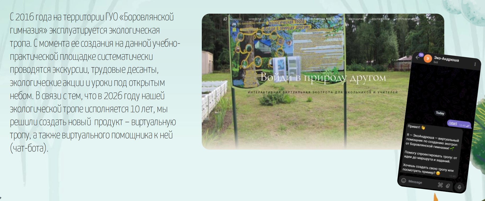

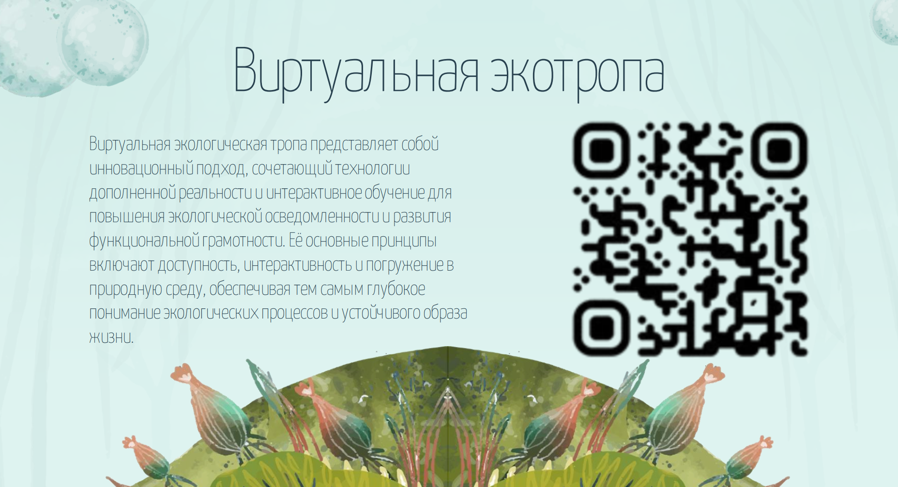

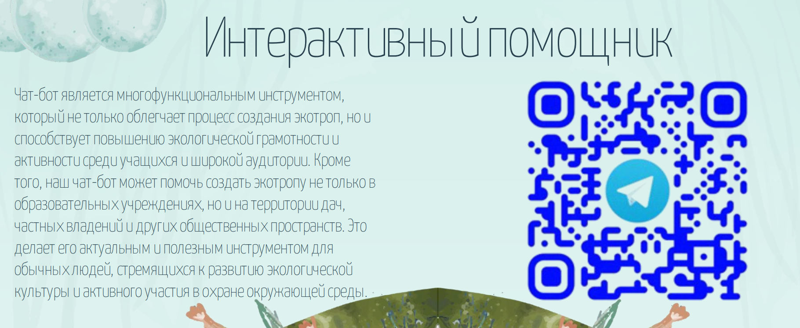

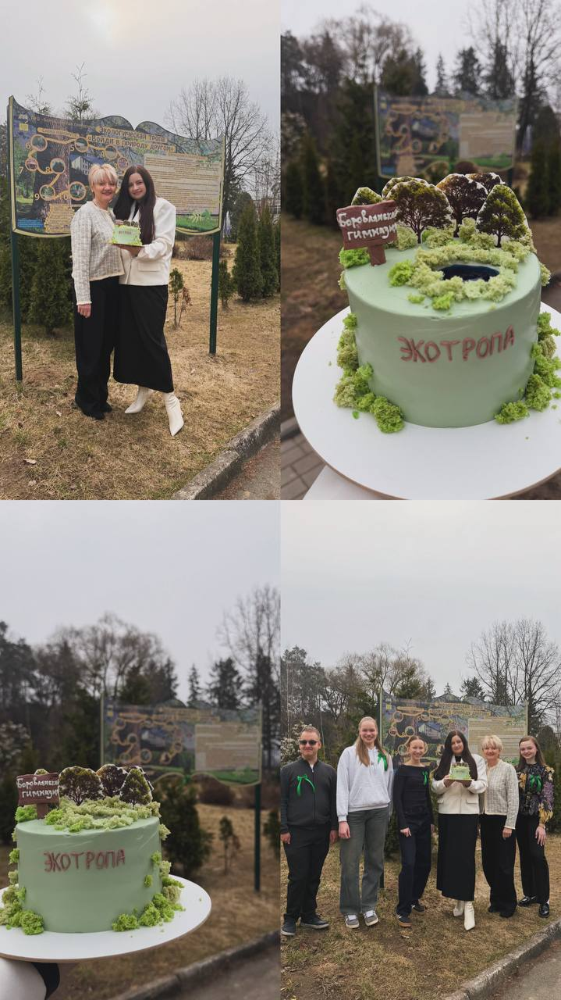

Экологической тропе «Войди в природу другом» 10 лет!

Направление, которое работает уже 7-й год…

ПРОВЕДЕНИЕ ПРЕДМЕТНЫХ ОНЛАЙН-НЕДЕЛЬ НА ПЛАТФОРМЕ INSTAGRAM КАК СРЕДСТВО РАЗВИТИЯ ПОЗНАВАТЕЛЬНОГО ИНТЕРЕСА УЧАЩИХСЯ

Instagram входит в число наиболее перспективных социальных платформ. Чем же занимаются наши учащиеся, когда пользуются данной платформой?     Я думаю, что ответ лежит на поверхности: точно не с обучающей целью ребята заходят в «мир Instagram»! Значит, нужно данную популярную социальную платформу рассмотреть с такой стороны, чтобы она стала полезной.

Цель предметных онлайн-недель – развитие познавательной и творческой активности учащихся; выявление учащихся, обладающих творческими способностями, стремящихся к углубленному изучению предметов; профориентационная направленность школьников.

Данный материал демонстрирует  методику организации проведения предметных недель в онлайн-формате; в нём представлены разработанные продукты: чек-лист и онлайн-недели. Предлагаемый методический продукт предназначен для использования учителями-предметниками при организации внеклассной работы по учебным предметам.

Для работы с онлайн-неделями создается отдельная группа учащихся ГНОУ (это микс из всех секций)

ЧЕК-ЛИСТ

«ОРГАНИЗАЦИЯ ПРЕДМЕТНЫХ ОНЛАЙН-НЕДЕЛЬ»

Организовать творческую группу учащихся.

Провести организационное собрание творческой группы и определиться с программой онлайн-недели, определить роль каждого учащегося (генератор идей, модератор, координатор, дизайнер, аналитик и т.д.).

Разработать конкурсные и информационные мероприятия.

Снять необходимые ролики и смонтировать их.

Организовать собрание творческой группы перед стартом онлайн-недели.

Запустить онлайн-неделю на платформе.

Контролировать деятельность творческой группы и оказывать необходимую помощь в течение недели.

Провести закрытие недели и объявить победителей.

Организовать итоговое собрание творческой группы и проанализировать результаты онлайн-недели.

Оформить отчет.

Примерный план проведения онлайн-недель можно посмотреть в таблице 1.

ДЕНЬ НЕДЕЛИ | МЕРОПРИЯТИЯ

Понедельник | День химической науки Онлайн-опросник «Химия вокруг нас» Интересные факты из области химии Онлайн-опыт «Трехслойная жидкость»

Вторник | День экологии Онлайн-опросник «Раздельный сбор мусора» Полезные сторис «Химические свойства чая» Онлайн-опыт «Резиновое яйцо» и «Приготовление мыльных пузырей»

Среда | День выпускника Онлайн - мастер-класс «Мир химических профессий» Презентация профессий, связанных с химией ( химия+математика , химия+биология ) Прямой эфир с выпускником гимназии (студентом БГМУ) Онлайн-опыт «Определение содержания крахмала в продуктах питания»

Четверг | День памяти Онлайн-трансляция «Выдающиеся учёные в области химии» Онлайн-викторина «Знаете ли Вы?» Онлайн-опыт «Химический вулкан»

Пятница | День красок Презентация эффектных химических опытов (трансляция из кабинета химии) Онлайн-газета «Новости химической науки» Онлайн-опыт «Лавовая лампа»

Понедельник | Прямой эфир «Подведение итогов онлайн-недели» Розыгрыш хим-био бокса при помощи программы « Lizaonair »

Таблица 1. Примерный план проведения онлайн-недели

(мероприятия по химии)

В ходе онлайн-недели предусмотрены как информационные, так и конкурсные мероприятия.

Информационные мероприятия онлайн-недели:

Интересные факты из области химии и биологии;

Insta_Stories  «Знаменитые химики и их вклад в развитие науки», «Великие ученые биологи и их открытия» (каждый день на страницах);

Полезные сторис «Химические свойства чая»;

Онлайн-мастер класс «Мир химических профессий», Презентация профессий, связанных с химией (химия+математика, химия+биология);

Онлайн-газета «Новости химической науки», «Новости биологической науки»;

Презентация эффектных химических опытов (прямая трансляция из кабинета химии) и др.

Конкурсные мероприятия онлайн-недели:

Выполнение онлайн-опытов и демонстрация их на своей странице Instagram;

Опросники по темам «Химия вокруг нас», «Биология вокруг нас»;

Онлайн-викторина «Знаете ли Вы?»;

Конкурс на «лучшее фото» и «самое креативное видео» и др.

В ПРИЛОЖЕНИИ пример оформления сторис на платформе Instagram и результаты работы гимназистов.

Ссылка на методический продукт с примерными планами предметных онлайн-недель различного цикла (неделя русского языка и литературы; белорусского языка и литературы; физики, математики и информатики; химии и биологии; английского языка; истории и обществоведения; географии и экологии).

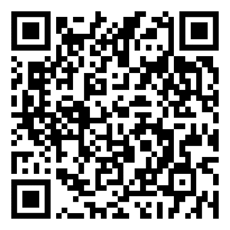

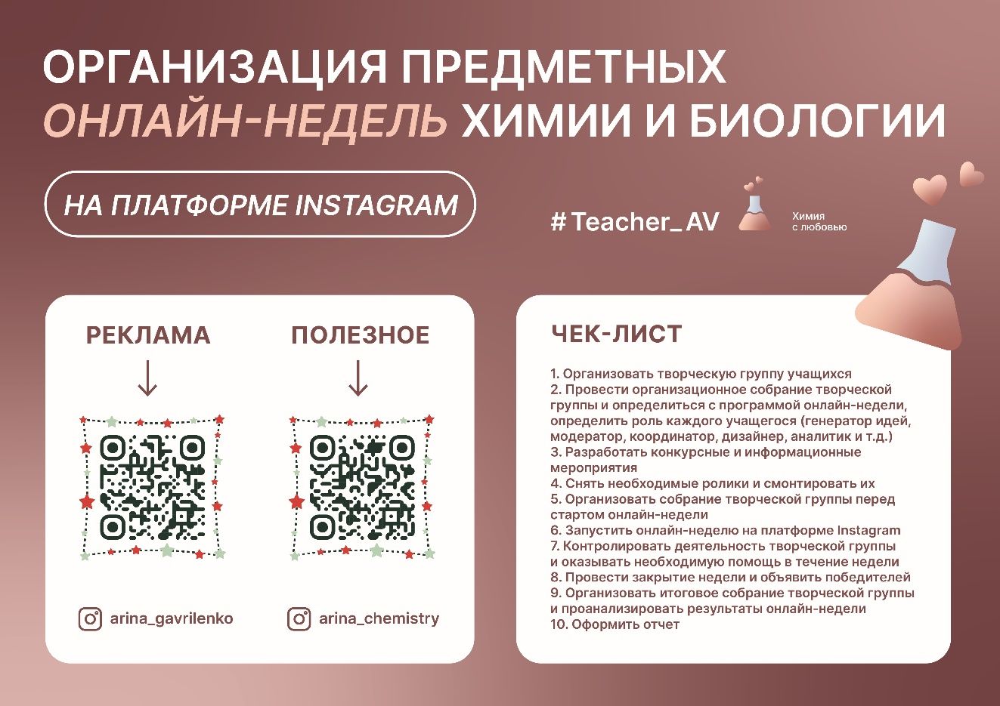

ПОЛЕЗНЫЕ СОВЕТЫ И ССЫЛКИ

Не обязательно задействовать личную страницу для проведения онлайн-недели, достаточно будет страницы школьной, а она есть у всех. Таким образом, вы внесете разнообразие на школьную страницу, и она будет активно работать.

Очень важно создать творческую группу учащихся и распределить их роли. У ребят всегда много креативных идей, а Вы будете выступать лишь руководителем. Часто слышу от учителей: «Ой, Instagram, я вообще не умею им пользоваться!» Это не важно! Главное, что им умеют пользоваться ваши учащиеся. И поверьте, стоит провести один раз такую неделю, и вы всему научитесь. Проверено на коллегах.

Обязательно узнайте, кто ответственный за страницу школы, так как целую неделю он будет выполнять поручения творческой группы учащихся.

Перед началом недели обязательно на странице в Insagram разместите напоминание, а затем пост со всеми подробностями. И постоянно общайтесь с учениками, вызывая обратную связь.

Конкретные примеры проведения онлайн-недели химии и биологии можно найти на страницах @arina_gavrilenko и @piletskaialena (папки в вечных сторис «ОНЛАЙН»)

https://www.youtube.com/watch?v=NWBeqcVaAt0 (создание опросов в сторис)

https://instagrami.ru/vedenie/viktoriny (создание викторин в сторис)

http://www.sev-chem.narod.ru/opyt.htm (занимательные опыты по химии. Можно использовать как для демонстрации из кабинета химии, так и для домашних экспериментов).

Программы, которые можно использовать для монтажа видео: Alive Movie Maker, Splice, GoPro Quik, VideoShow, KineMaster, WeVideo.

Я предлагаю в 2024/2025 учебном году провести внутри школ такие недели, устроить баттл. Как это может выглядеть? Все опять же просто! Например, творческая группа учащихся снимает какой-то эксперимент и отмечает несколько школ, чтобы они повторили его (при этом ОБЯЗАТЕЛЬНО нужно отметить школу). Школы снимают креативные  ролики, отмечают гимназию (отчет о проделанной работе, скажем так). Потом эти школы другим бросают «вызов». Можно не только опыты снимать, можно задавать интересные вопросы из области различных предметов, предложить решить задачу и т.д. (полностью креатив инициативной группы учащихся и учителей).

ЗАКЛЮЧЕНИЕ

Развитие образования через дистанционные предметные недели

С убеждением хочу выразить важность дистанционных предметных недель для учащихся, увлеченных изучением отдельных учебных предметов. Эти мероприятия дают возможность удовлетворить познавательный интерес учащихся, расширить знания и контролировать собственный уровень подготовки, а также осуществить первые шаги в профессиональной сфере. Ежегодно меняются программа и эксперименты, что придает им обновленный характер. Имеет смысл отметить, что такие недели позволяют раскрыть потенциал учащихся, которые не всегда могут проявить себя полностью в рамках обычного учебного процесса. Эти инициативы открывают возможности для разнообразия в образовательном процессе, интегрируя современные платформы в учебную деятельность.

Информационные технологии играют значительную роль в стимулировании обучения, научно-исследовательской работы, экспериментов, разработки инновационных проектов и научных публикаций. Мы полагаем, что в эпоху информационных технологий их применение в системе образования является необходимостью, способной подготовить учащихся к вызовам современной жизни. Эти недели предлагают уникальные возможности для учащихся, позволяя им не только углубить знания в выбранных предметах, но и развить навыки самостоятельной работы, коллаборации и профессионального роста. Инновационный подход к проведению онлайн-мероприятий дает учащимся возможность на практике применить свои знания и умения, что в свою очередь благоприятно влияет на их мотивацию и самооценку.

Знания для будущего! Подобные инициативы в образовании являются семенем, высаженным в поле будущего. Создание стимулирующей, интерактивной образовательной среды помогает учащимся готовиться к сложным вызовам и требованиям современного мира, таким как развитие критического мышления, проблемного решения и сотрудничества – навыков, необходимых в XXI веке.

Трансляция опыта по данной теме:

Статья в «Настаўніцкай газеце» по теме «Інтэрнэт тыдні у Instagram».

https://nastgaz.by/internet-tydzen-himii-u-instagram-unikalnym-vopytam-padzyalilasya-nastaunitsa-aryna-gaurylenka/

Мастер-класс для молодых специалистов Минского района (в рамках марафона для молодых специалистов). Тема: «Организация предметных онлайн-недель химии и биологии на платформе Instagram».

Мастер-класс для учителей Минской области в рамках конкурса профессионального мастерства «Учитель года Минской области 2023». Тема: «Организация предметных онлайн-недель химии и биологии на платформе Instagram»

https://drive.google.com/drive/folders/1kJXtkS015J0RLXOsqAqKvFN_u2m3ts49?hl=ru

Аналогичные недели разработаны для педагогов России «Проведение предметных онлайн - недель химии и биологии на платформе VK».  Международный профессионально-методический конкурс «Преподаватель года 2023» (диплом I степени в номинации «Инновационные технологии в педагогической деятельности»).

https://drive.google.com/drive/folders/1dlkfHXIaiQEQG83ga5vURsYOpFCkGgTj?hl=ru

Мастер-класс для педагогов Республики Беларусь в рамках ХIII республиканского рождественского фестиваля педагогического мастерства, проводимого ГУО «Академия последипломного образования». Тема: «Рекомендации по проведению предметных онлайн-недель химии и биологии на платформе Instagram».

Список литературы

Зайцева, С. А., Информационные технологии в образовании / С.А. Зайцева, В.В. Иванова. – М.: ЭГРИ, 2010. – 222 с

ПРИЛОЖЕНИЕ

Перед Вами несколько примеров сторис, которые выставляла на протяжении всей недели химии и биологии на своей странице в Instagram @piletskaialena (учитель биологии)

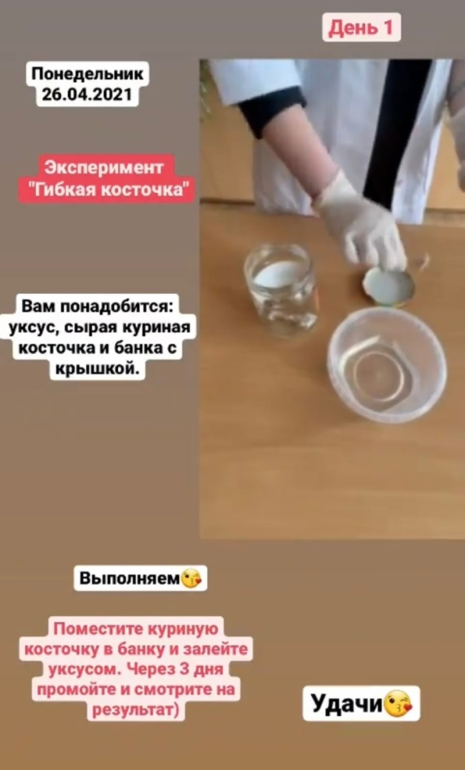

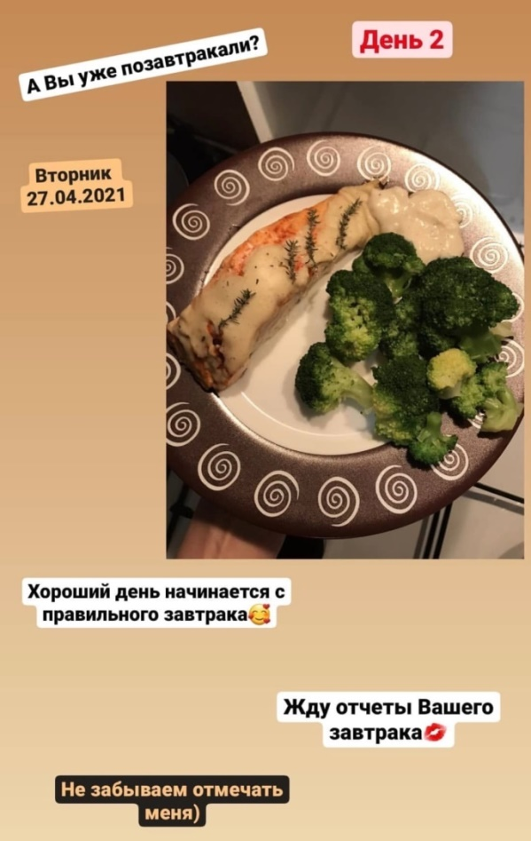

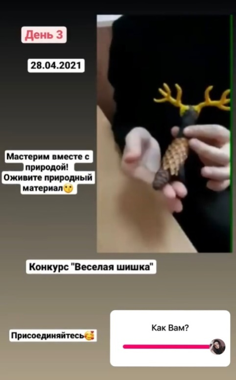

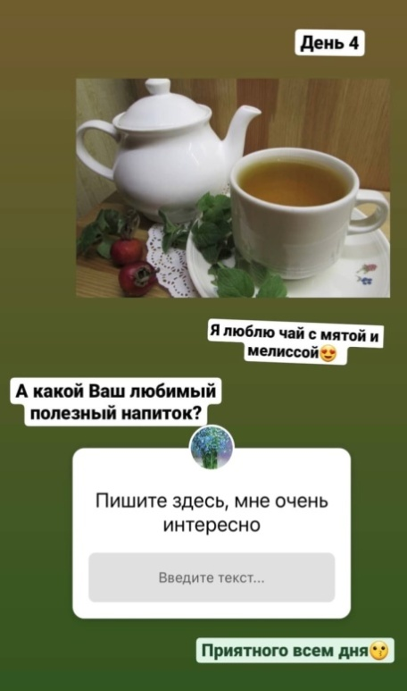

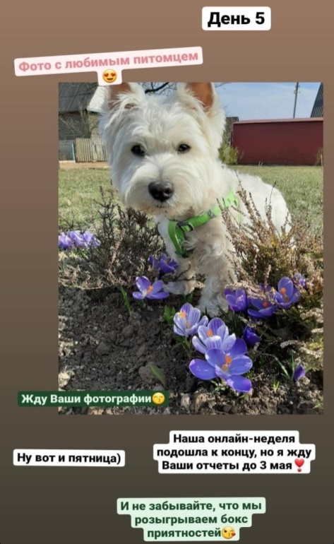

ФОТООТЧЁТЫ ГИМНАЗИСТОВ

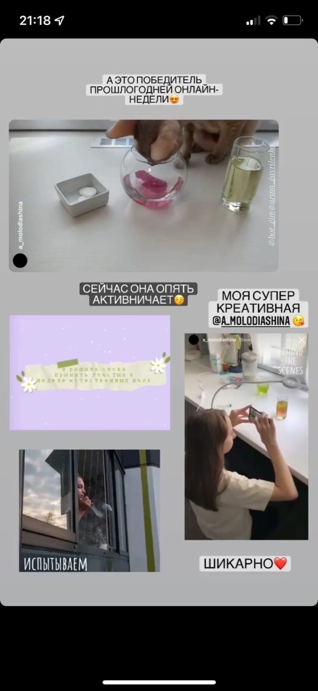

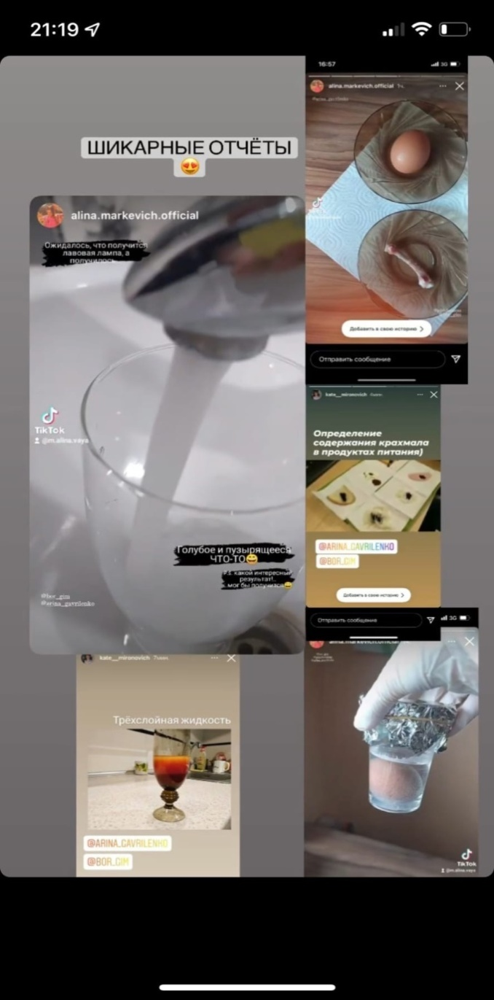

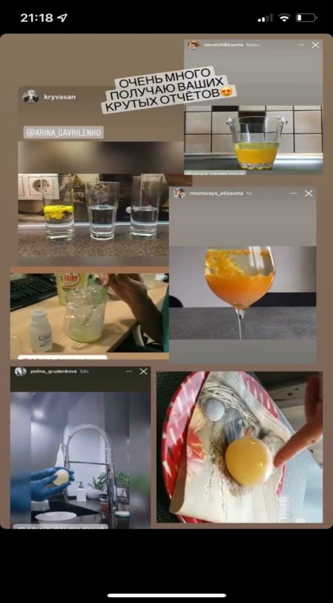

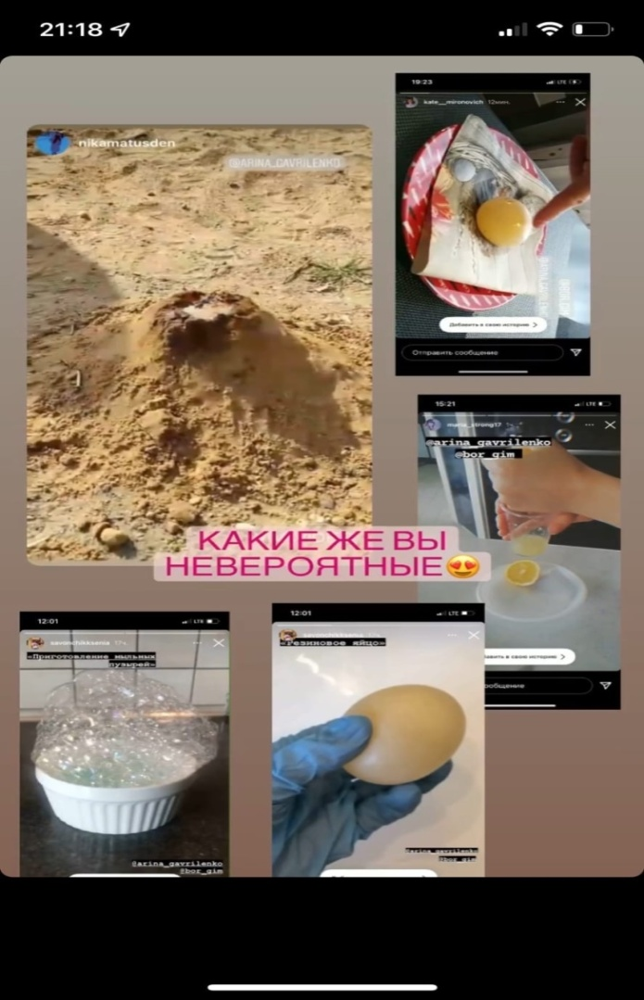

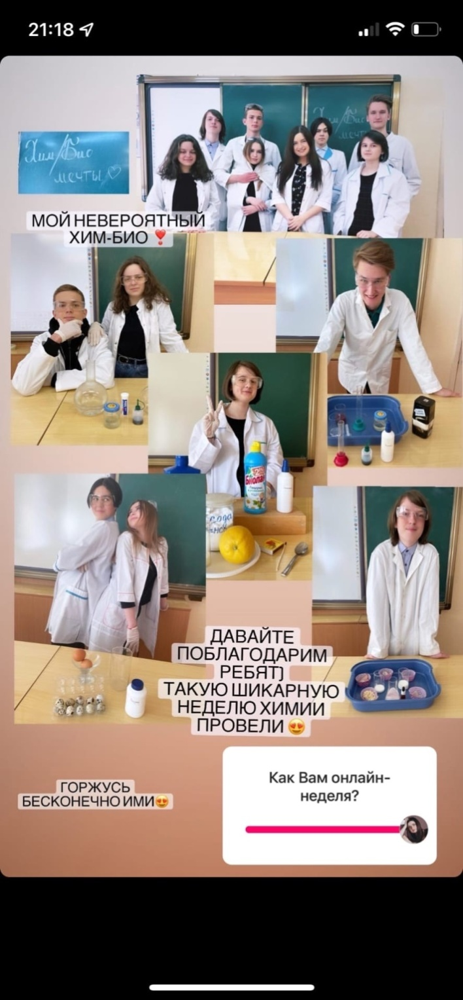

После завершения недели с творческой группой проводим прямой эфир, где учащиеся делятся своими впечатлениями и мы озвучиваем победителей.

(разыгрываем «хим-био бокс»)

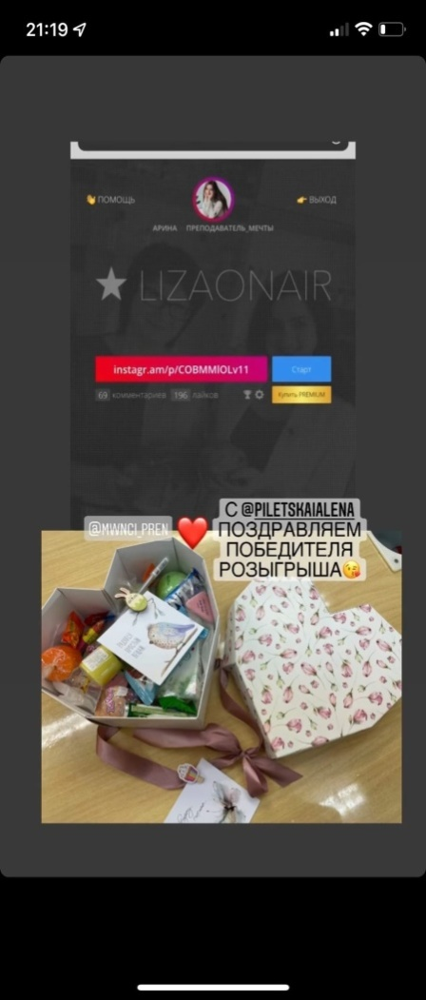

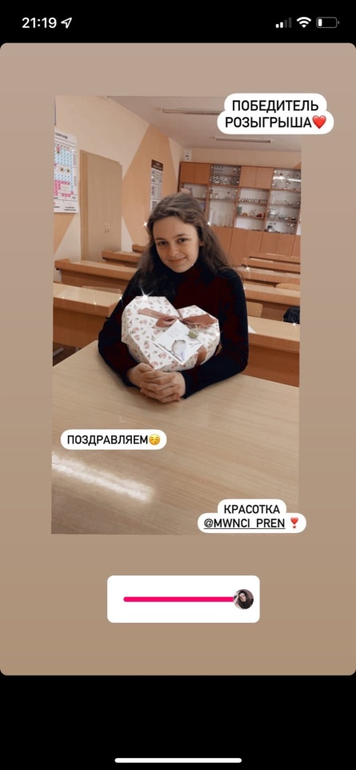

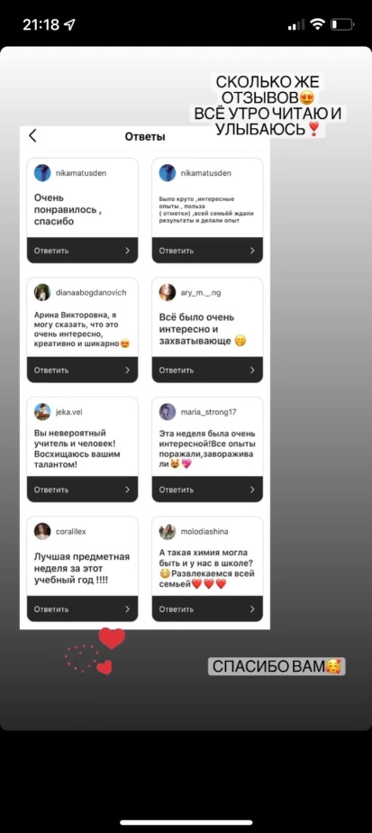

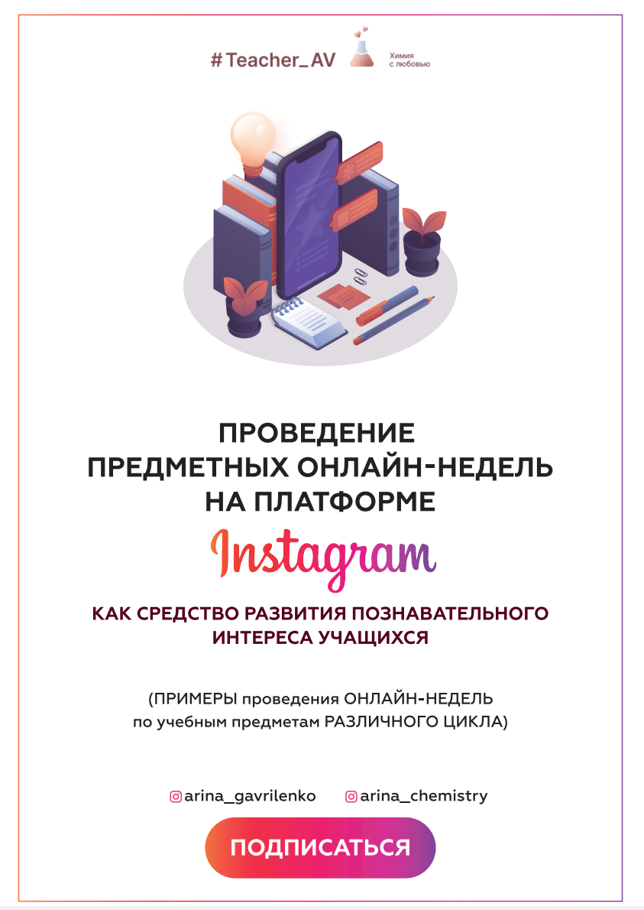

ГУО «Боровлянская гимназия»

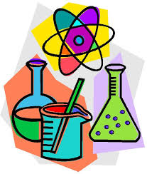

Объединение по интересам

«Юный химик», 5-7 классы

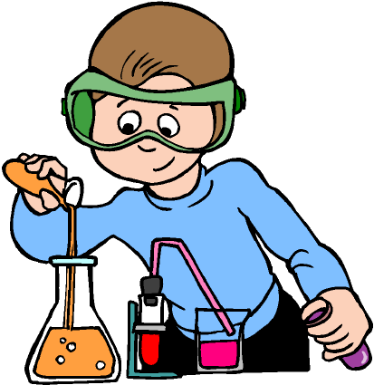

Результаты 2015-2016 учебного года

Учитель химии

Гавриленко Арина Викторовна

1. Выращивание кристаллов различного цвета:

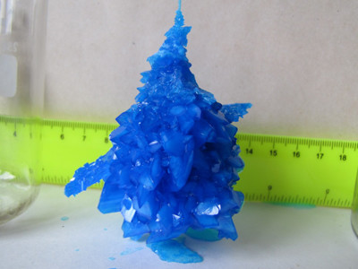

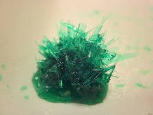

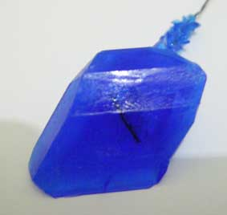

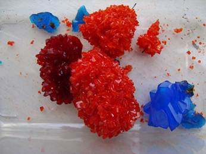

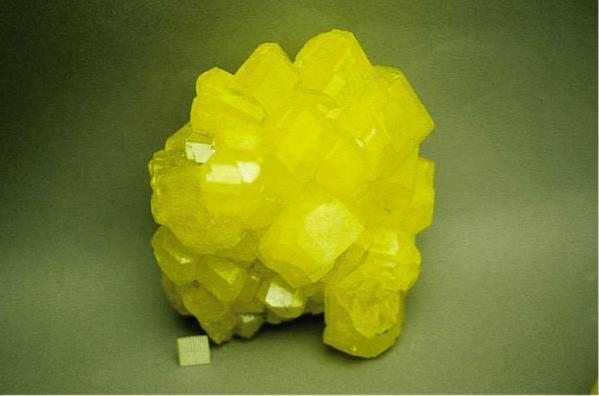

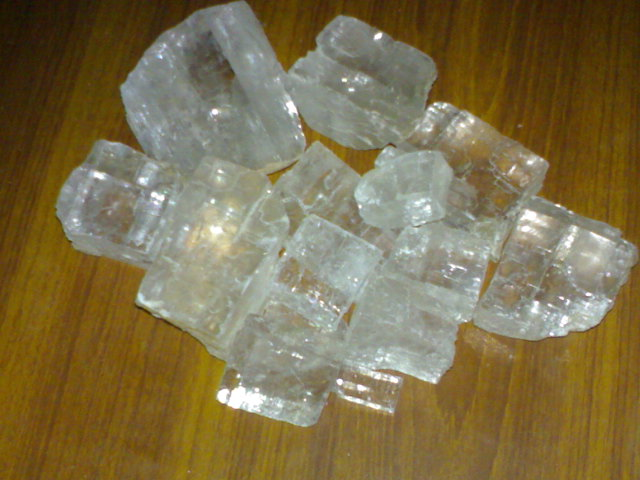


\


2. Мыловарение:


Мастер-класс «Мыло своими руками». Выступление на семинаре:


3. Изготовление моделей молекул:


4. Создание своего аромата духов:


5. Проведение эффектных химических опытов:


Химия дает в руки человеку огромные возможности и силы, но при этом требует грамотного, ответственного их использования.


Успешно усвоена программа объединения по интересам «Юный химик»:

Смеси в жизни человека.

Химия пищи.

Спички.

В мире красок и карандашей.

Химия стирает, чистит и убирает.

Керамика.

Химия – хозяйка домашней аптечки.

Химия – помощница садовода.

Химия и ювелирные украшения.

Занимательная химия.


Выполнены следующие практические работы:

Получение каучука из листьев фикуса.

Анализ воды из природных источников.

Самодельные духи.

Мыло своими руками.

Получение поваренной соли и ее очистка.

Анализ прохладительных напитков.

Определение содержания жиров в семенах растений.

Химические опыты с жевательной резинкой.

Изучение свойств различных видов бумаги.

Изготовление минеральных пигментов разных цветов.

Изучение физических свойств различных стекол.

Определение среды в мылах и шампунях.

Приготовление мыла из свечки и стиральной соды.

Выведение пятен с ткани.

Правильное питание с точки зрения химии.

Широко распространяет химия руки свои в дела человеческие. (М.В. Ломоносов)

***

Химия-это область чудес, в ней скрыто счастье человечества, величайшие завоевания разума будут сделаны именно в этой области. (М. Горький)

***

Кто не понимает ничего, кроме химии, тот и ее понимает недостаточно. (Г. Лихтенберг)

***

Химия разума: мудрость конденсирует, а глупость растворяет. (Болеслав Вольтер)

***

Всякий необходимо причиняет пользу, употребленный на своем месте. Напротив того: упражнения лучшего танцмейстера в химии неуместны; советы опытного астронома в танцах глупы. (Прутков Козьма)

***

Ближайший предмет химии составляет изучение однородных веществ, из сложения которых составлены все тела мира, превращений их друг в друга и явлений, сопровождающих такие превращения. (Д.И. Менделеев)

***

«Как химик, я убежден в возможности получения питательных веществ из сочетания элементов воздуха, воды и земли, помимо обычной культуры, т.е. на особых фабриках и заводах. Но надобность в этом ещё далека от современности. Потому что пустой земли ещё везде много…  (Д.И.Менделеев)

***

Пища, которую организм не переваривает, съедает того, кто ее съел. Поэтому ешь в меру. (Абу-аль-Фарадж)

***

Нет токсичных веществ, а есть токсичные дозы. (Парацельс)

***

Химия дает в руки человеку огромные возможности и силы, но при этом требует грамотного, ответственного их использования.

***

Человек – единственное существо на Земле, которое практически всю свою пищу подвергает химической или термической обработке, а так же заботится о ее сохранности , аромате и нужной окраске.


6. Правильное питание с точки зрения химии:


7. Химические шоу:

